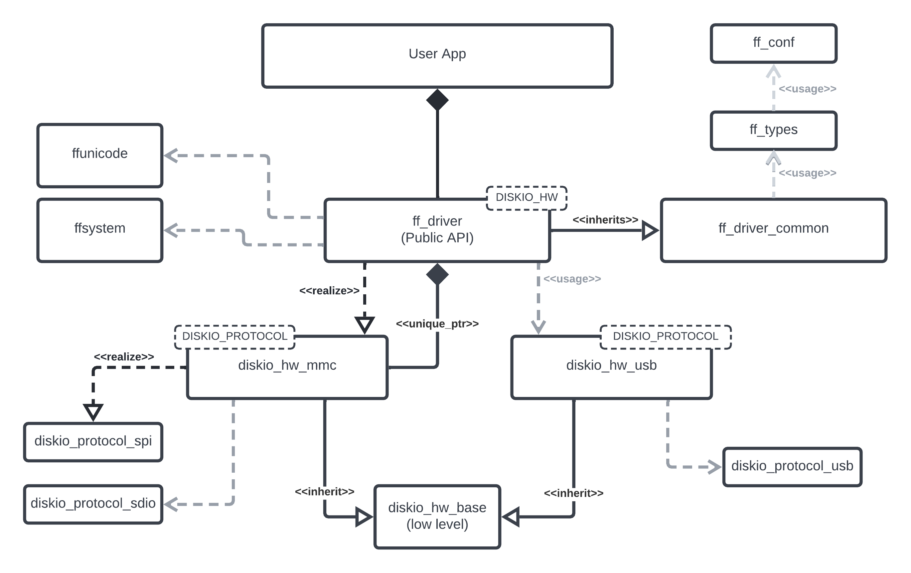
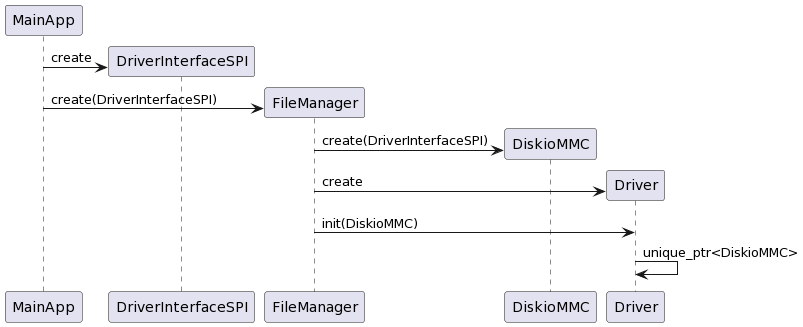

### cpp_fatfs
A C++ port of the fatfs library

### Architecture

The main architecture consists of a public API that uses a lower level disk IO layer. 



Details of the STM32 SPI interface (SPI_TypeDef, GPIO ports and pins) are passed as a `DriverInterfaceSPI` object into the `DiskioMMC` class.  The `DiskioMMC` object is then passed into the main `Driver` API class. A `FileManager` class can be used to manage the `DiskioMMC` and `Driver` objects.



<!-- @startuml
MainApp -> DriverInterfaceSPI ** : create
MainApp -> FileManager ** : create(DriverInterfaceSPI)
FileManager -> DiskioMMC ** : create(DriverInterfaceSPI)
FileManager -> Driver ** : create
FileManager-> Driver : init(DiskioMMC)
Driver -> Driver : unique_ptr<DiskioMMC>
@enduml -->

### CMake

```
add_subdirectory(cpp_fatfs)

```

### Usage

```
#include <diskio.hpp>

fatfs::DiskioMMC diskio;
fatfs::Driver fatfs_handle(diskio);
fatfs::FATFS fs;
fatfs::FIL fil;
char sd_path[4];          /* uSD device logical drive path */
fatfs::FRESULT fres;
fres = fatfs_handle.f_mount(&fs, (fatfs::TCHAR const*)sd_path, 1); //1=mount now
fres = fatfs_handle.f_open(&fil, (fatfs::TCHAR const*)sd_path, 1);

std::array<char, 100> read_buff;
fatfs::UINT bytes_read {0};
fres = fatfs_handle.f_read(&fil, read_buff.data(), read_buff.size(), &bytes_read);

std::array<char, 100> write_buff;
fatfs::UINT bytes_written {0};
fres = fatfs_handle.f_write(&fil, write_buff.data(), write_buff.size(), &bytes_written);

if (fres != fatfs::FRESULT::FR_OK) {
    // something bad happened
}	
```

