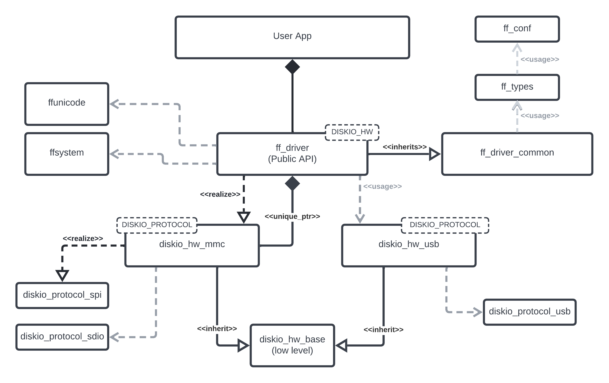
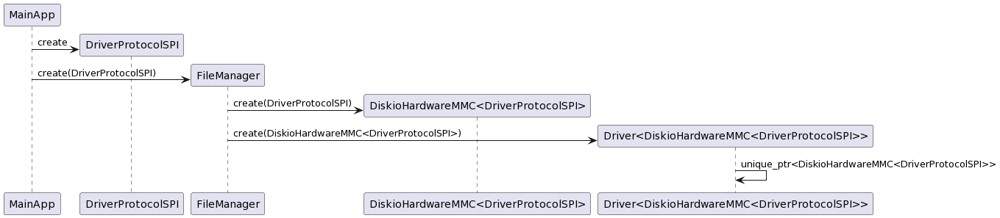

### Architecture

The main architecture consists of a public API that uses a lower level disk IO layer. This shows specific implementations of the DiskIO layer for MMC/SD and USB. 



Details of the STM32 SPI interface (SPI_TypeDef, GPIO ports and pins) are passed as a `DriverInterfaceSPI` object into the `DiskioHardwareMMC` class.  The `DiskioHardwareMMC` object is then passed into the main `Driver` API class. A `FileManager` class can be used to manage the `DiskioHardwareMMC` and `Driver` objects.



<!-- @startuml
MainApp -> DriverProtocolSPI ** : create
MainApp -> FileManager ** : create(DriverProtocolSPI)
FileManager -> "DiskioHardwareMMC<DriverProtocolSPI>" ** : create(DriverProtocolSPI)
FileManager -> "Driver<DiskioHardwareMMC<DriverProtocolSPI>>" ** : create(DiskioHardwareMMC<DriverProtocolSPI>)
"Driver<DiskioHardwareMMC<DriverProtocolSPI>>" -> "Driver<DiskioHardwareMMC<DriverProtocolSPI>>" : unique_ptr<DiskioHardwareMMC<DriverProtocolSPI>>
@enduml -->


### Usage

```
#include <diskio.hpp>

fatfs::DiskioHardwareMMC diskio;
fatfs::Driver fatfs_handle(diskio);
fatfs::FATFS fs;
fatfs::FIL fil;
char sd_path[4];          /* uSD device logical drive path */
fatfs::FRESULT fres;
fres = fatfs_handle.f_mount(&fs, (fatfs::TCHAR const*)sd_path, 1); //1=mount now
fres = fatfs_handle.f_open(&fil, (fatfs::TCHAR const*)sd_path, 1);

std::array<char, 100> read_buff;
fatfs::UINT bytes_read {0};
fres = fatfs_handle.f_read(&fil, read_buff.data(), read_buff.size(), &bytes_read);

std::array<char, 100> write_buff;
fatfs::UINT bytes_written {0};
fres = fatfs_handle.f_write(&fil, write_buff.data(), write_buff.size(), &bytes_written);

if (fres != fatfs::FRESULT::FR_OK) {
    // something bad happened
}	
```

### Running Units Tests on X86

Running `cmake` in the root directory will invoke the tests.
It is recommended to use VSCode and "CMake Tools" extension with Test Suite, but if you insist on using the CLI:

- Configure the testsuite:
`cmake --no-warn-unused-cli -DCMAKE_EXPORT_COMPILE_COMMANDS:BOOL=TRUE -DCMAKE_BUILD_TYPE:STRING=Debug -DCMAKE_C_COMPILER:FILEPATH=/bin/x86_64-linux-gnu-gcc-10 -Bbuild -G Ninja .`
- Build the testsuite
`cmake --build build --config Debug --target all --`
- Run the testsuite
`./build/test_suite`
- Clean the testsuite
`cmake --build build --config Debug --target clean --`

### Adding this library to your STM32 Project

Include this repo into your project as a submodule and add the following line to your top-level CMakeFiles.txt:

`add_subdirectory(embedded_utils)`

This assumes your project's top-level CMakeFiles.txt is already configured for STM32 platform.

### Debug

`GDB` is enabled in VSCode (F5)

### Code Coverage report

Run the "coverage report" task. Results can be found in `coverage` directory.